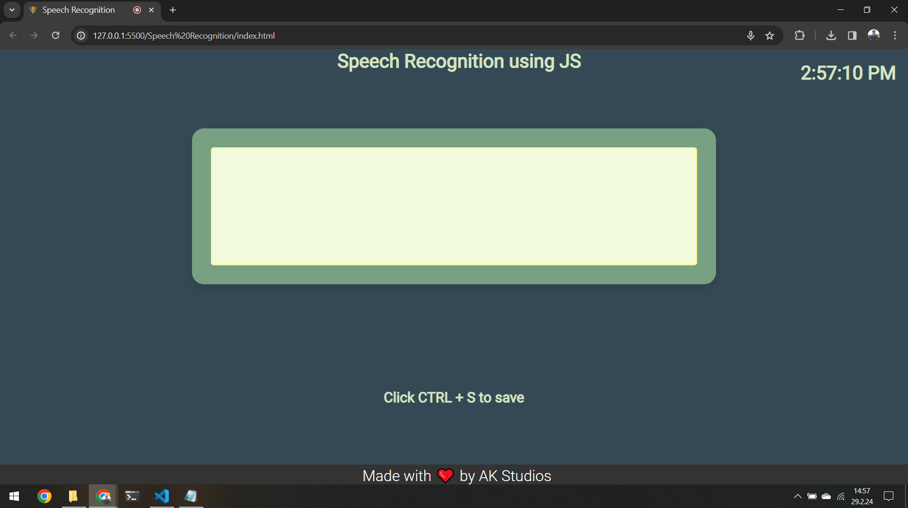
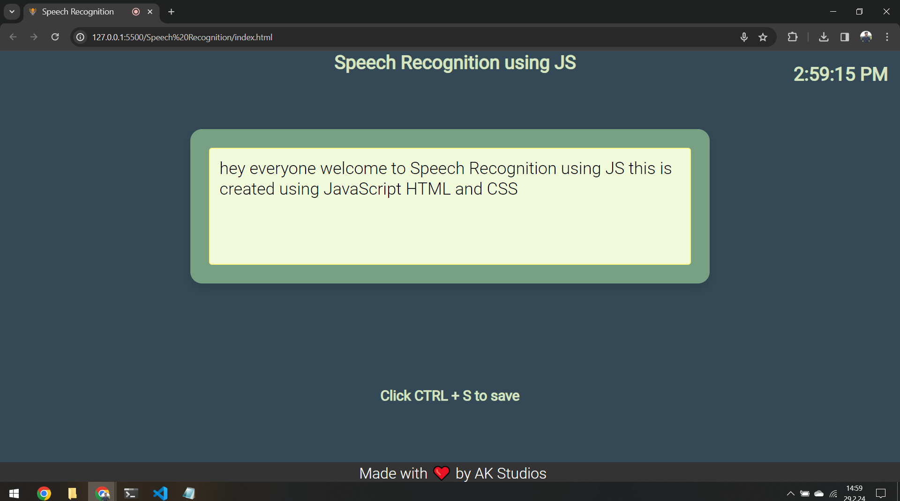
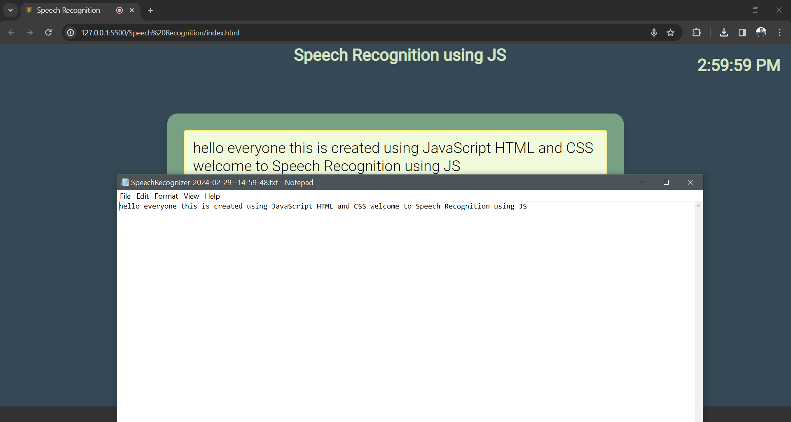

# Speech Recognition using JavaScript

This is a simple web application for speech recognition using JavaScript.

## Demo

Check out the live demo of the Hex Color Generator:
[Live Demo](https://speech-recognizer-ak.netlify.app) 

## Features

- Transcribes speech input in real-time.
- Allows users to save the transcribed text as a text file.
- Clock display showing the current time.

## Clone the Repo
[git clone https://github.com/AbidKhan01ak/Speech-Recognition.git](https://github.com/AbidKhan01ak/Speech-Recognition.git)

## Usage

1. Open `index.html` in a web browser.
2. Click on the microphone icon and start speaking.
3. The transcribed text will appear in the text area.
4. Press Ctrl + S to save the transcribed text as a text file.

## Preview

## Credits

Made with ❤️ by [AK Studios](https://github.com/AbidKhan01ak).

## License
This project is licensed under the MIT License - see the [LICENSE](LICENSE) file for details.

